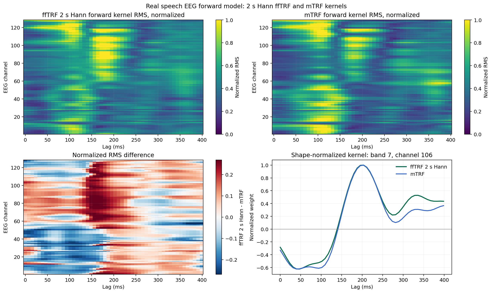
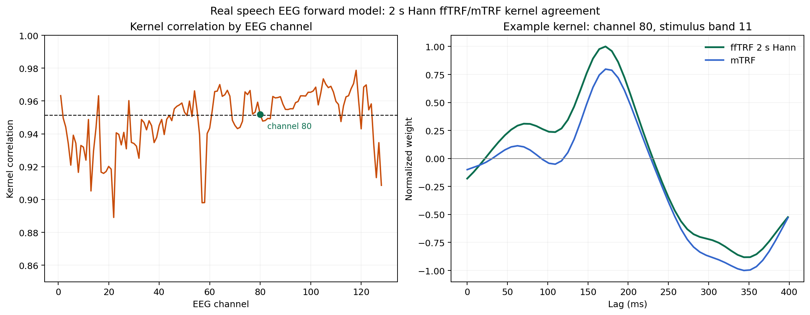
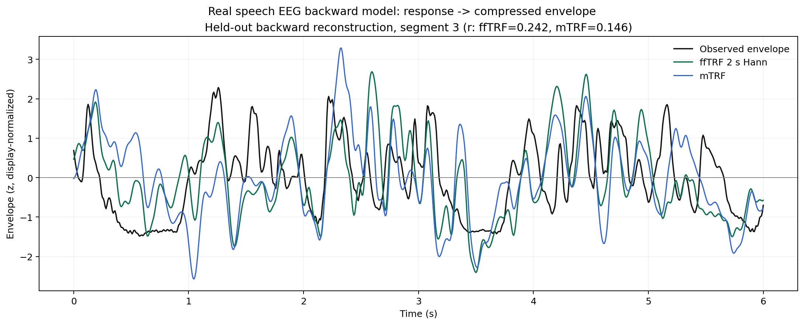
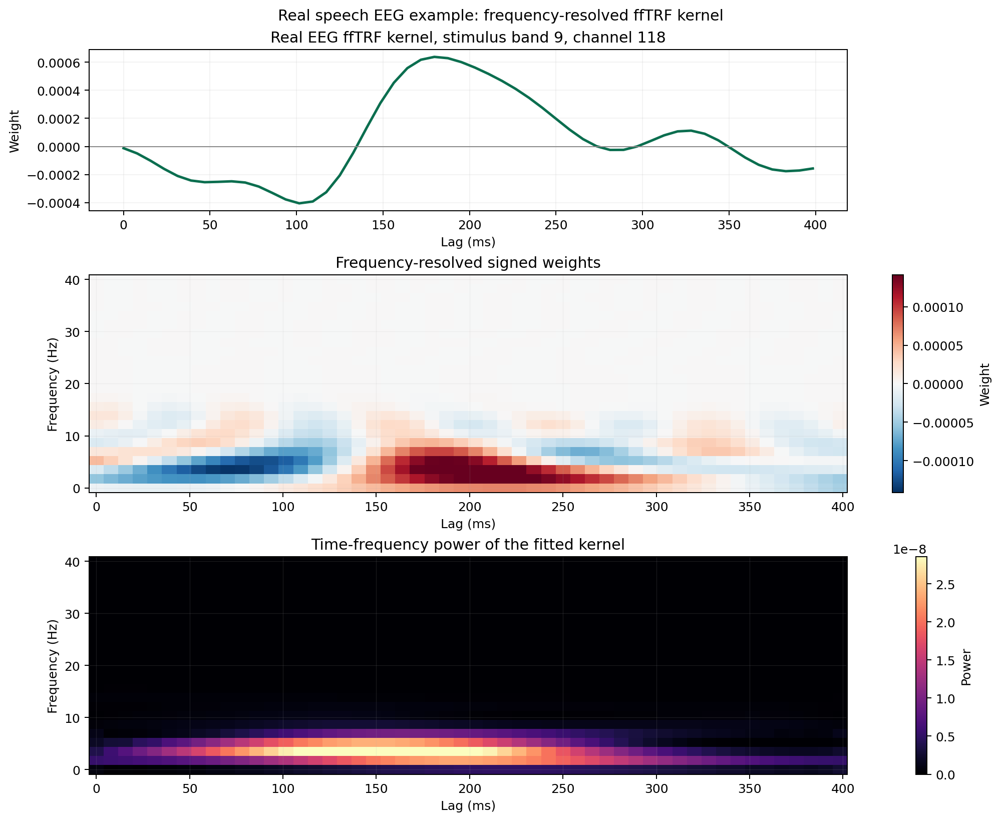

# Comparison With mTRF on Real Speech-EEG Data

This comparison uses the same public speech-EEG sample as the real-data
benchmark and the focused EEG examples.

- 16 speech-spectrogram bands
- 128 EEG channels
- 128 Hz sampling rate
- ten 12-second segments
- seven segments for training and cross-validation
- three untouched segments for evaluation

The sample is pinned to mTRFpy commit
`9b89449caaed3a4b7c80ea238a52c34a723cb8de`.
See [Sample-Data Provenance and Integrity](examples.md#sample-data-provenance-and-integrity)
for the download and restricted-decoding safeguards.


## Practical Forward-Kernel Comparison

This figure compares mTRF with the practical ffTRF configuration using
two-second Hann windows. It summarizes the full 16-input, 128-output kernel
bank.



The broad lag structure is similar, but the difference map is not expected to
be zero. Segmentation and Hann windowing change the spectral estimator.
This figure should be interpreted as a comparison of practical workflows—not as
evidence that the two estimators are mathematically identical.

## Kernel Agreement Across EEG Channels

The channel-wise correlation plot makes agreement and disagreement visible
across the whole sensor set. The second panel shows a fixed example
(stimulus band 11, EEG channel 80).



Kernel correlations quantify shape similarity after flattening inputs and
lags within each channel. They do not replace held-out prediction: correlated
predictors can produce different coefficient patterns while yielding similar
predictions.

## Backward Reconstruction

The backward model uses 128 EEG channels to reconstruct a compressed broadband
speech envelope. This is also the high-dimensional setting in which avoiding an
explicit predictor-lag matrix can be especially valuable.



For decoding, held-out reconstruction is the primary result. Decoder weights
are multivariate filters and should not be interpreted as if they were forward
neural response kernels.

## An ffTRF-Specific View of the Same Dataset

After validating the forward model, ffTRF can decompose its fitted transfer
function into lag-frequency representations:



This is not an mTRF equivalence result. It shows an additional descriptive view
of the fitted ffTRF kernel. The
[Frequency-Resolved Notebook](notebooks/frequency-resolved.ipynb) provides a
self-contained simulation with separate code and plots for signed weights,
magnitude, and Hilbert power.

## Runtime, Memory, and Held-Out Accuracy

The [real speech-EEG benchmark report](https://github.com/weigla/ffTRF/blob/main/artifacts/real_eeg_benchmark.md)
contains repeated isolated-process timings, total and additional peak RSS,
selected ridge values, and held-out prediction scores for both the matched and
practical configurations.

Read the columns together:

- runtime answers how long fitting and CV took
- peak RSS describes the memory cost of the complete process
- held-out correlation checks whether a computational saving came with a
  predictive trade-off
- matched rows compare the nearest solver settings
- practical rows intentionally compare different estimators

## Reproducing the Real-Data Comparison

The comparison requires the optional `mtrf` development dependency:

```bash
pixi run -e compare python examples/compare_real_eeg_with_mtrf.py
pixi run -e compare real-eeg-benchmark
pixi run -e compare python examples/generate_documentation_figures.py
```

The first command generates the matched held-out prediction figure. The
documentation generator produces the kernel, channel-agreement,
frequency-resolved, and backward figures. The benchmark command writes the
Markdown and raw JSON performance reports.

