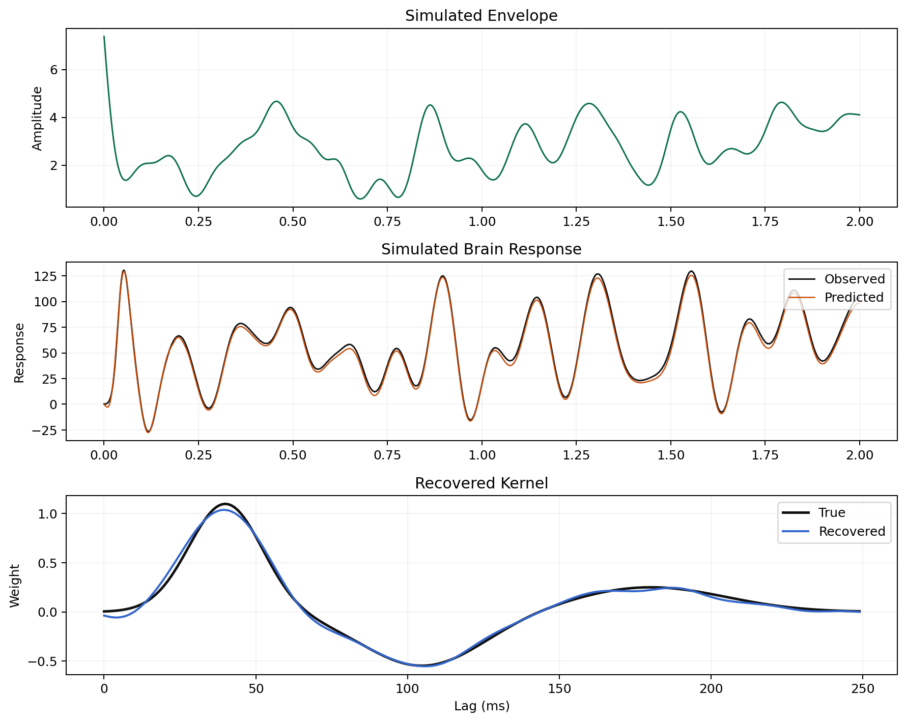
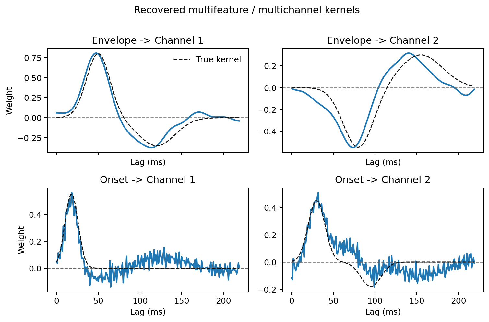
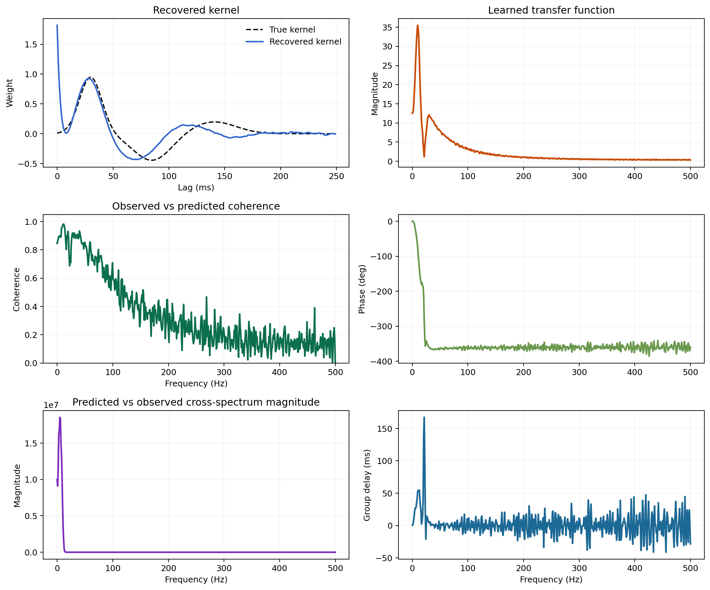
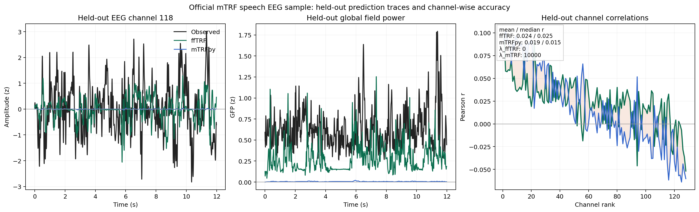

# Examples

The repository ships runnable scripts under `examples/`. They are meant to be
small, focused walkthroughs of the main API patterns. The descriptions below
explain what each script is meant to teach so users can jump straight to the
example that matches their workflow.

## Core Examples

| Script | Use case |
| --- | --- |
| `example_single_trial_single_channel.py` | Smallest forward-model example: one predictor, one output, one trial |
| `example_multi_trial_single_channel.py` | Multi-trial fit with cross-validation and explicit trial weighting |
| `example_multifeature_multichannel.py` | Multiple predictors and multiple outputs, including grid plotting |
| `example_banded_regularization.py` | Grouped predictor regularization for feature blocks with different ridge penalties |
| `example_multitaper_estimator.py` | DPSS multi-taper estimation through `train_multitaper(...)` |
| `example_frequency_resolved_weights.py` | Frequency-resolved lag-domain maps and spectrogram-like kernel views |
| `example_backward_decoding.py` | Backward decoding with `direction=-1` |
| `example_bootstrap_confidence_interval.py` | Stored bootstrap intervals and uncertainty-aware kernel plots |
| `example_trial_weighting.py` | Inverse-variance trial weighting and weighted vs unweighted fits |
| `example_save_and_load.py` | Serialization, deserialization, and impulse-response export |

## Comparison and Benchmarking

| Script | Use case |
| --- | --- |
| `compare_with_mtrf.py` | Synthetic kernel comparison against time-domain references |
| `example_mtrf_sample_eeg.py` | Public speech-EEG comparison against `mTRF`, with `neg_mse` lambda selection and held-out Pearson reporting for a forward benchmark plus a backward compressed-envelope benchmark that reconstructs a `p=0.4` broadband target using segmented Hann windows and a wider lambda search in ffTRF |
| `benchmark_runtime.py` | Runtime benchmark against `mTRF` under several scenarios |

## Which Example Should I Start With?

- Start with `example_single_trial_single_channel.py` if you want the shortest
  possible end-to-end script.
- Start with `example_multi_trial_single_channel.py` if your real data come in
  multiple trials and you expect to use cross-validation.
- Start with `example_multifeature_multichannel.py` if your predictors are
  multi-dimensional or your response has several channels.
- Start with `example_backward_decoding.py` if your use case is decoding rather
  than forward encoding.
- Start with `example_multitaper_estimator.py` if you already know you want the
  DPSS workflow.

## Running Examples

Core examples:

```bash
python examples/example_single_trial_single_channel.py
python examples/example_multi_trial_single_channel.py
python examples/example_multitaper_estimator.py
```

Optional comparison environment:

```bash
pixi run -e compare compare-demo
pixi run -e compare benchmark-demo
pixi run -e compare python examples/example_mtrf_sample_eeg.py
```

## Rendered Notebooks

If you want a more tutorial-style presentation than the plain scripts, the docs
site also renders lightweight notebooks:

- [Getting Started Notebook](notebooks/getting-started.ipynb)
- [Frequency-Resolved Notebook](notebooks/frequency-resolved.ipynb)

These notebooks mirror the same public API as the scripts while interleaving
code, explanation, and representative plots.

## What to Look For

When reading the examples, pay attention to:

- how single arrays differ from lists of trials
- how `direction` changes which side is treated as predictor vs target
- when `train(...)` returns `None` versus cross-validation scores
- how the same fitted model can be inspected with lag-domain plots,
  frequency-domain diagnostics, and bootstrap intervals

## Gallery








