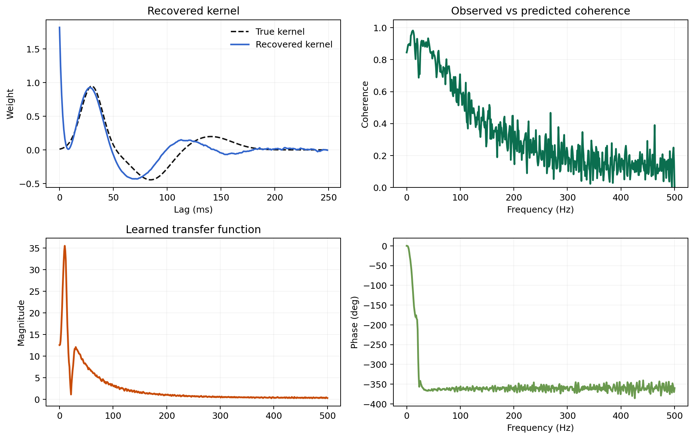

# Multitaper Estimation

`ffTRF` includes an optional DPSS multi-taper estimator for more stable
spectral estimates in noisy continuous-data settings.

## Why Use Multi-Taper Estimation?

Compared with the standard single-window FFT estimator, multi-taper estimation
can reduce variance in the spectral estimates by averaging across several
orthogonal tapers.

This can help when:

- the data are noisy
- segments are relatively short
- you want smoother, more stable cross-spectral estimates

The tradeoff is stronger spectral smoothing.

## Convenience API

```python
scores = model.train_multitaper(
    stimulus=stimulus,
    response=response,
    fs=fs,
    tmin=0.0,
    tmax=0.120,
    regularization=np.logspace(-5, -1, 5),
    segment_duration=1.024,
    time_bandwidth=3.5,
    k="loo",
)
```

Representative lag-domain output from the bundled multi-taper example:


## Equivalent Low-Level Form

```python
scores = model.train(
    stimulus=stimulus,
    response=response,
    fs=fs,
    tmin=0.0,
    tmax=0.120,
    regularization=np.logspace(-5, -1, 5),
    spectral_method="multitaper",
    time_bandwidth=3.5,
    n_tapers=None,
    window=None,
)
```

`train_multitaper(...)` is just a convenience wrapper around this pattern.

## Important Parameters

- `time_bandwidth`: controls the time-bandwidth product of the DPSS tapers
- `n_tapers`: number of tapers to average over
- `segment_length` or `segment_duration`: still controls the segment size used
  for the spectra

Larger `time_bandwidth` values:

- allow more tapers
- increase smoothing
- can improve stability in noisy settings

## Important Restriction

`window` must stay `None` in multi-taper mode because the DPSS tapers already
define the segment weighting.

The stored diagnostics from a multi-taper fit can also be inspected visually:



## Practical Advice

- Start with `time_bandwidth=3.5` unless you have a strong reason not to.
- If you mainly care about fine spectral detail, do not oversmooth.
- If ordinary fits are noisy or unstable, try multi-taper before making the
  model itself more complicated.

## Downstream Analysis Is the Same

Once the model is fitted, the rest of the API stays the same:

- `predict(...)`
- `score(...)`
- `plot(...)`
- `plot_transfer_function(...)`
- `cross_spectral_diagnostics(...)`
- `frequency_resolved_weights(...)`

So multi-taper changes how the model is estimated, not how it is used later.
