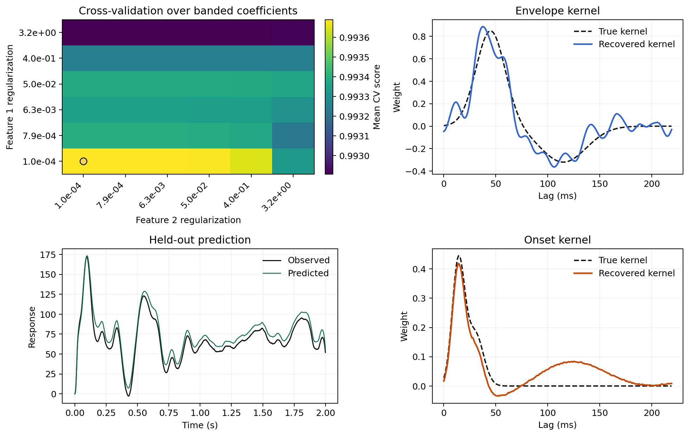

# Regularization and Cross-Validation

`TRF.train(...)` supports both direct fixed-ridge fitting and cross-validated
regularization search.

## Scalar Ridge

Pass one scalar to fit directly:

```python
model.train(
    stimulus=stimulus,
    response=response,
    fs=fs,
    tmin=0.0,
    tmax=0.120,
    regularization=1e-3,
)
```

Use this when:

- you already know a sensible ridge value from previous experiments
- you want the fastest possible fit
- you are running a reproducible pipeline with fixed hyperparameters

In this mode, `train(...)` returns `None` because no candidate grid is
evaluated.

## Cross-Validated Search

Pass a 1D grid to evaluate multiple candidates:

```python
scores = model.train(
    stimulus=stimulus,
    response=response,
    fs=fs,
    tmin=0.0,
    tmax=0.120,
    regularization=np.logspace(-6, 0, 7),
    k=4,
    segment_duration=1.024,
    overlap=0.5,
)
```

In this mode:

- one score is computed per candidate regularization value
- the best candidate is chosen automatically
- the final model is refit on all supplied trials using that best candidate
- the candidate grid is stored in `model.regularization_candidates`

Internally, `ffTRF` builds the trial spectra once, then reuses them across
folds and regularization candidates. During validation scoring it also caches
predictor FFTs within each fold, so repeated candidate evaluation avoids
rebuilding the same prediction-side transforms. This applies to both scalar
ridge and banded regularization searches and does not change the selected
solution or the returned scores.

## The Meaning of `average`

The `average` argument controls how scores are reduced across outputs:

- `average=True`: return one score per regularization candidate
- `average=False`: keep one score per output
- `average=[...]`: average only over the listed outputs

This matters when different output channels behave differently. For example,
you might want to select regularization based only on a subset of channels.

## The Meaning of `k`

- `k="loo"` or `k=-1`: leave-one-out over trials
- `k=4`, `k=5`, ...: split trials into that many folds

Use leave-one-out when trial count is small and you want maximal use of the
data per fold. Use a smaller number of folds when trial count is large and
runtime matters more.

## Banded Regularization

If your predictor contains grouped features, provide `bands` so each group can
receive its own ridge coefficient:

```python
model.train(
    stimulus=stimulus,
    response=response,
    fs=fs,
    tmin=0.0,
    tmax=0.120,
    regularization=np.logspace(-5, 0, 5),
    bands=[1, 16],
    k=4,
)
```

Example interpretation of `bands=[1, 16]`:

- first feature belongs to group 1
- next 16 features belong to group 2

In banded mode, `ffTRF` expands the chosen coefficients into a per-feature
penalty vector internally. Cross-validation still reuses the same cached fold
spectra and validation predictor FFTs, so the banded search stays much cheaper
than rebuilding the full prediction path from scratch for every candidate.

The example below shows how grouped predictors can produce visibly different
kernel structure when each block receives its own regularization strength:



## Segment Choices Matter Too

Regularization is not the only stability control. Segment settings matter as
well:

- longer segments improve frequency resolution
- shorter segments can increase the number of independent observations
- overlap can stabilize estimates when segments are short
- windowing can reduce spectral leakage in the standard estimator

If a model feels unstable, consider segment settings alongside ridge values.
The dedicated [Choosing Segment Settings](choosing-segment-settings.md) guide
collects the practical rules of thumb in one place.

## Practical Advice

- Use direct fitting when you already know a sensible ridge value.
- Use `k="loo"` when you have only a small number of trials.
- Use `k=4` or `k=5` when trial count is larger and runtime matters more.
- Use longer segments when you care about lag resolution and narrower spectral
  smoothing.
- Start with a broad log-spaced grid, then narrow it once you know the useful
  range for your data.
