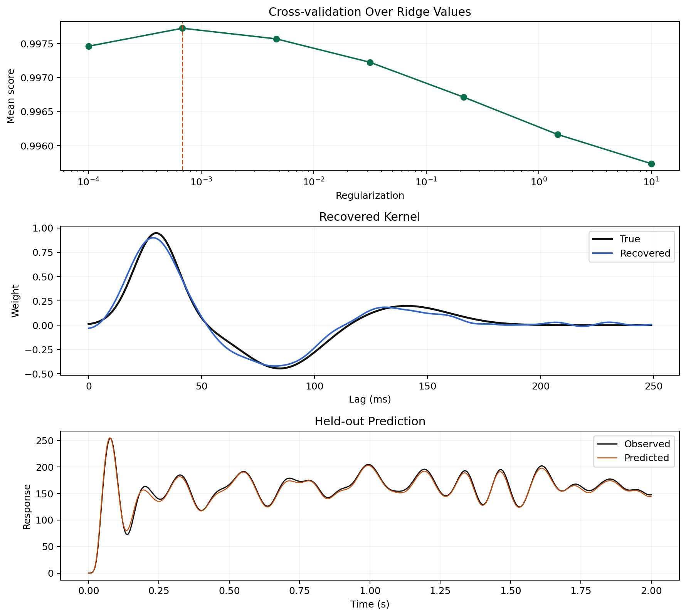
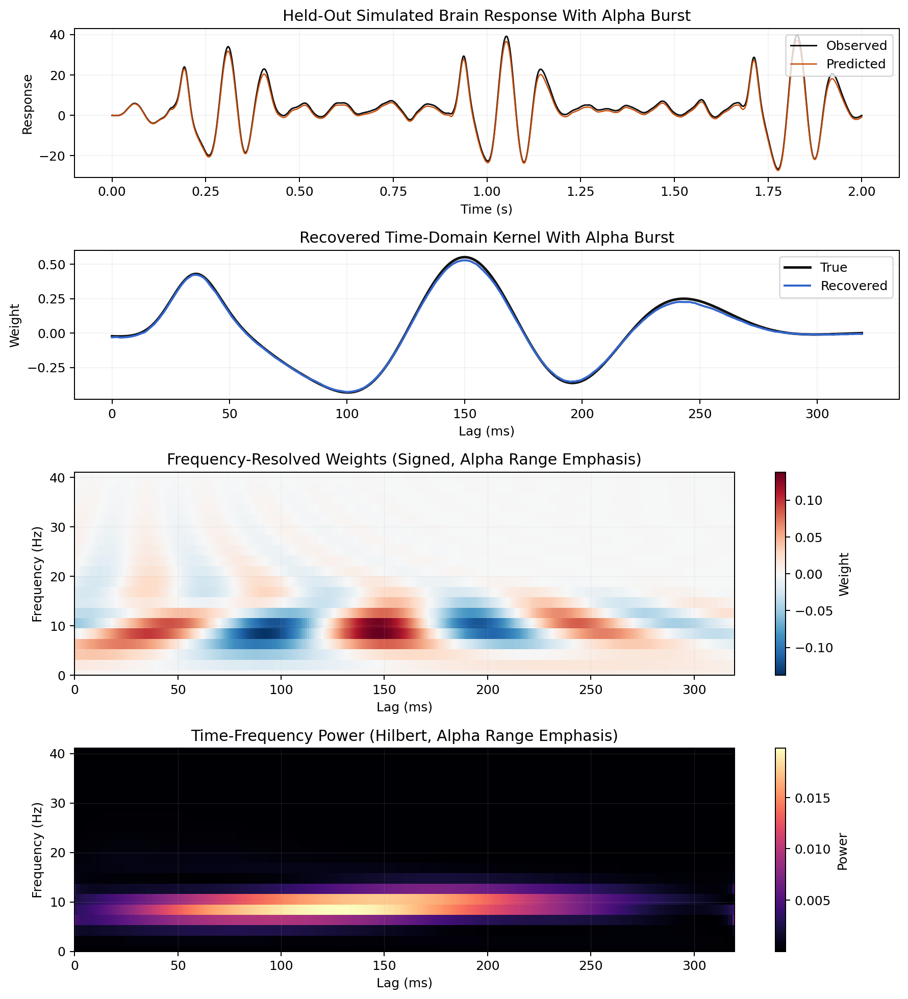

# ffTRF

`ffTRF` is a Python toolbox for fitting temporal response functions in the
frequency domain. It is designed for continuous stimulus-response modeling
without tying the workflow to one modality, one preprocessing stack, or one
experimental paradigm.

The main estimator is `fftrf.TRF`. It supports:

- forward and backward TRF fitting
- scalar ridge and cross-validated ridge selection
- optional banded regularization for grouped predictors
- optional DPSS multi-taper spectral estimation
- multi-trial input as Python lists of arrays
- time-domain kernel export for interpretation
- bootstrap confidence intervals
- permutation-based held-out score significance testing
- optional stronger refit-based null-model significance testing
- transfer-function and cross-spectral diagnostics
- frequency-resolved lag-domain views of recovered kernels

## Workflow at a Glance

The typical workflow is:

1. prepare stimulus and response arrays with matching sample counts per trial
2. create `TRF(direction=1)` for forward encoding or `TRF(direction=-1)` for
   backward decoding
3. call `train(...)` or `train_multitaper(...)`
4. inspect the fitted kernel with `plot(...)` or `plot_grid(...)`
5. evaluate generalization with `predict(...)`, `score(...)`, or
   `permutation_test(...)`
6. inspect spectral behavior with transfer-function and coherence diagnostics
7. save the fitted model with `save(...)` if you want to reuse it later

`ffTRF` stores both the complex frequency-domain transfer function and the
derived lag-domain kernel, so users can move between time-domain and
frequency-domain views without retraining.

## Start Here

- New to the package: go to [Getting Started](getting-started.md)
- Prefer a tutorial you can read like a lab notebook: go to
  [Getting Started Notebook](notebooks/getting-started.ipynb)
- Need the full workflow explained end to end: go to
  [Core Workflow](guides/core-workflow.md)
- Need shape conventions and multi-trial rules: go to
  [Inputs and Shapes](guides/inputs-and-shapes.md)
- Looking for runnable demos: go to [Examples](examples.md)
- Looking for API docs: go to [Reference](reference/index.md)
- Working on the repo itself: go to [Development](development.md)

## Installation

For local development, Pixi is the primary supported workflow:

```bash
pixi install
pixi run import-check
pixi run -e test test
```

For a lightweight editable install:

```bash
pip install -e .
```

Optional extras:

```bash
pip install -e ".[test]"
pip install -e ".[compare]"
pip install -e ".[docs]"
```

## What ffTRF Actually Fits

The estimator solves for a complex transfer function in the frequency domain
and then transforms that solution into a time-domain kernel over the lag window
you request with `tmin` and `tmax`.

That has a few practical consequences:

- you do not need to build an explicit lag matrix yourself
- fitting can reuse cached per-trial spectra across cross-validation folds
- the same fitted model can be inspected in both lag-domain and
  frequency-domain forms
- optional multi-taper estimation fits into the same API instead of requiring a
  separate estimator class

## Documentation Map

- [Getting Started](getting-started.md): first fit, first prediction, first plot
- [Core Workflow](guides/core-workflow.md): how the estimator is meant to be
  used step by step
- [Inputs and Shapes](guides/inputs-and-shapes.md): single-trial vs multi-trial
  conventions and direction-dependent behavior
- [Regularization and CV](guides/regularization.md): direct fits, CV grids, and
  banded ridge
- [Choosing Segment Settings](guides/choosing-segment-settings.md): practical
  defaults for `segment_duration`, overlap, and windowing
- [Multitaper Estimation](guides/multitaper.md): when and how to use DPSS
- [Frequency-Resolved Analysis](guides/frequency-resolved.md): lag-frequency
  views of the fitted kernel
- [Diagnostics and Transfer Functions](guides/diagnostics-and-transfer-functions.md):
  spectral inspection tools
- [Trial Weighting and Bootstrap](guides/trial-weighting-and-bootstrap.md):
  weighting noisy trials and quantifying uncertainty
- [Significance Testing](guides/significance-testing.md): permutation-based
  null distributions for held-out scores
- [Notebooks](notebooks/getting-started.ipynb): rendered walk-throughs with the
  same API used in the example scripts
- [Reference](reference/index.md): detailed function-by-function API

## Example Gallery

### Single-Trial Forward Model


### Multi-Trial Cross-Validation



### Frequency-Resolved Weights



### Real EEG Comparison


